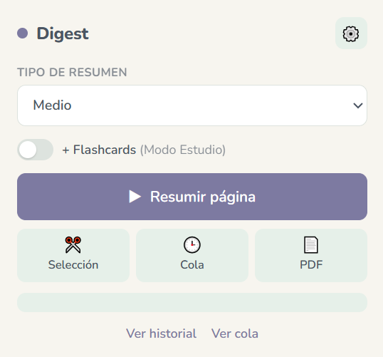
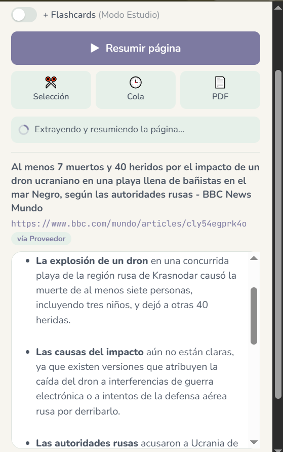
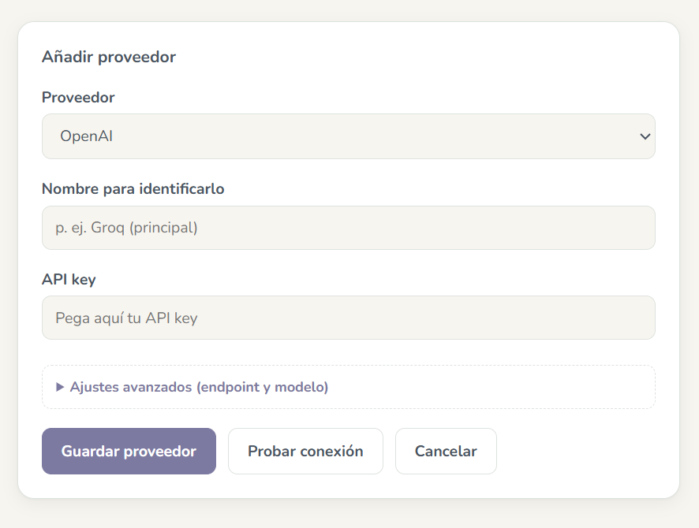
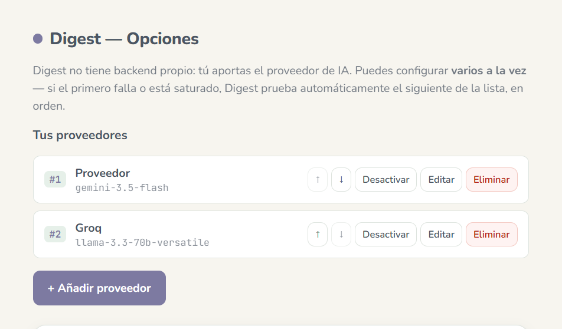
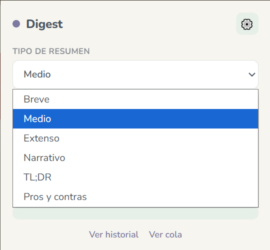
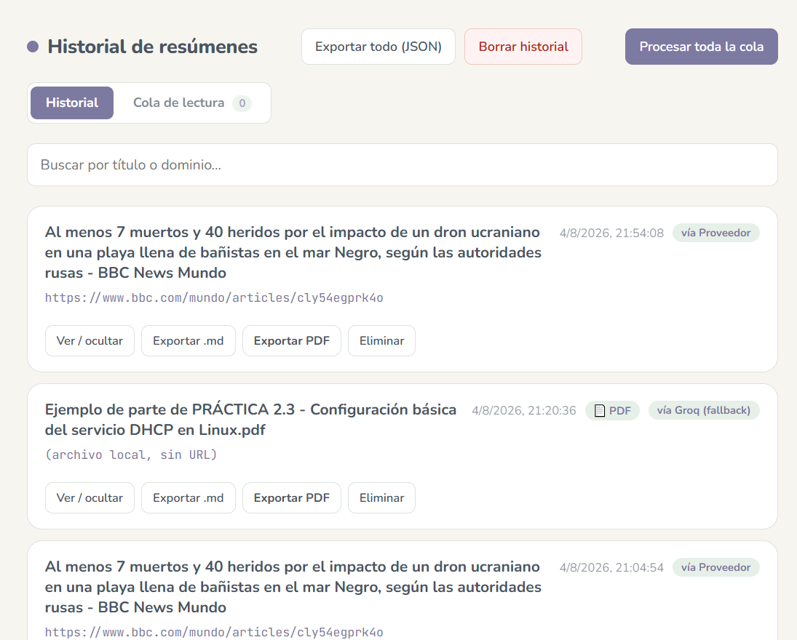
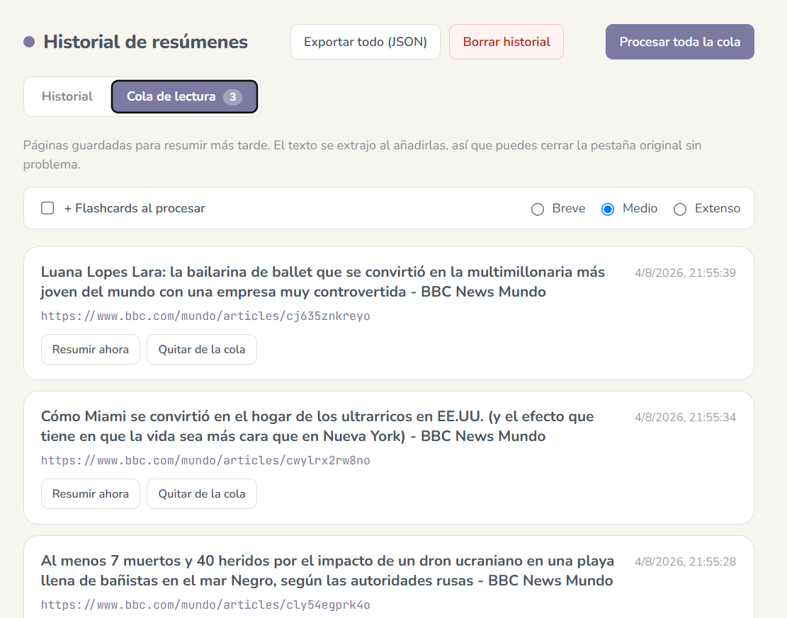

# Digest — Resumidor con IA

Extensión de Chrome (Manifest V3) que convierte "leer algo → quedarte con lo importante → guardarlo o repasarlo" en un flujo que no sale del navegador. Resume páginas web, PDFs y selecciones de texto con la IA que tú elijas, genera flashcards para repasar, guarda cosas para más tarde en una cola de lectura, y exporta todo a Markdown, PDF o Anki.

Sin backend propio: tú aportas tu propia API key (OpenAI, Gemini, Groq, OpenRouter...) o apuntas a un modelo local con [Ollama](https://ollama.com). Nada se envía a ningún servidor de Digest, porque no existe tal servidor.

| Popup (inicio) | Popup (resumen generado) |
|---|---|
|  |  |

| Opciones — añadir proveedor | Opciones — lista de proveedores |
|---|---|
|  |  |

**Opciones — tipos de resumen personalizables**

| Historial | Cola de lectura |
|---|---|
|  |  |

## Índice

- [Instalación](#instalación-modo-desarrollador)
- [Resumir contenido](#resumir-contenido)
- [Modo Estudio (flashcards)](#modo-estudio-flashcards)
- [Cola de lectura](#cola-de-lectura)
- [Proveedores de IA y fallback automático](#proveedores-de-ia-y-fallback-automático)
- [Exportar](#exportar)
- [Historial](#historial)
- [Privacidad y permisos](#privacidad-y-permisos)
- [Solución de problemas](#solución-de-problemas)
- [Roadmap](#roadmap)
- [Licencia](#licencia)

## Instalación (modo desarrollador)

Esta extensión no está en la Chrome Web Store — se instala manualmente, como cualquier proyecto en desarrollo:

1. Clona este repositorio.
2. Ve a `chrome://extensions`.
3. Activa "Modo de desarrollador" (interruptor arriba a la derecha).
4. Pulsa "Cargar descomprimida" y selecciona la carpeta del proyecto.
5. Abre Opciones (icono ⚙️ en el popup), añade un proveedor de IA (ver [más abajo](#proveedores-de-ia-y-fallback-automático)) y pega tu API key.

## Resumir contenido

Tres formas de entrada, todas con el mismo resultado — un resumen que puedes guardar, exportar o convertir en flashcards:

- **Página completa**: botón "▶ Resumir página". Extrae el contenido con [Readability.js](https://github.com/mozilla/readability) (la misma librería del modo lectura de Firefox), así que ignora menús, anuncios y barras laterales y se queda con el artículo real.
- **Selección de texto**: botón "✂️ Selección". Resume solo el texto que tengas seleccionado en la página.
- **PDF**: si la pestaña activa ya muestra un PDF, "Resumir página" lo detecta solo. También puedes importar cualquier PDF de tu equipo con el botón "📄 PDF" sin necesidad de abrirlo antes en el navegador. Ver [detalle técnico](#cómo-funciona-la-importación-de-pdf).

También disponible desde el menú contextual (clic derecho) sin tener que abrir el popup: "Resumir selección con Digest" y "Resumir esta página con Digest".

**Tipo de resumen**, elegible en un desplegable antes de generar. De serie trae seis: **Breve** (1-2 frases), **Medio** (bullets con los puntos clave), **Extenso** (estructurado por secciones), **Narrativo** (párrafo fluido sin listas), **TL;DR** (una frase) y **Pros y contras**. La lista es totalmente personalizable desde Opciones → "Tipos de resumen": puedes editar el nombre y las instrucciones de cada uno, añadir los tuyos propios, reordenarlos, borrarlos o restaurar los valores por defecto — el mismo desplegable se usa en el popup y en la cola de lectura. El resumen se muestra con formato real — negrita, listas, encabezados — en vez de texto plano con `**` sueltos de por medio.

## Modo Estudio (flashcards)

Activa el interruptor "+ Flashcards" antes de resumir y, además del resumen, Digest genera **5 preguntas y respuestas** sobre el contenido (mismo proveedor de IA que respondió el resumen).

Pulsa "Usar flashcards →" y se abre una pestaña de estudio dedicada (`study.html`) con una sesión real, no solo una lista:

- Una tarjeta a la vez, con animación de giro al revelar la respuesta (clic o barra espaciadora).
- Autoevaluación "😊 La sabía" / "😕 No la sabía" tras cada una.
- Barra de progreso y resumen final con el recuento.
- Botón "Repetir solo las falladas" para un segundo pase centrado en lo que fallaste.

Las flashcards también se pueden exportar a **CSV** listo para importar en Anki (`pregunta;respuesta`), tanto desde el popup justo después de generarlas como desde cualquier entrada del historial.

## Cola de lectura

Para cuando encuentras algo interesante pero no quieres pararte a resumirlo en ese momento: botón "🕒 Cola" en el popup (o "Añadir página a la cola de Digest" en el menú contextual) guarda el título, la URL y el texto ya extraído — así puedes cerrar la pestaña original sin perder nada.

Desde la pestaña "Cola de lectura" del historial (`history.html`, o el enlace "Ver cola" del popup):

- Resume un elemento suelto con "Resumir ahora".
- O procesa toda la cola de golpe con "Procesar toda la cola" — uno detrás de otro, no en paralelo, para no disparar de golpe el límite de peticiones de un proveedor gratuito.

## Proveedores de IA y fallback automático

Opciones guarda una **lista** de proveedores, no uno solo. Añade los que quieras y reordénalos con las flechas ↑/↓ — el primero de la lista es el que se intenta primero. Si da un error (saturación, límite de peticiones, key inválida...), Digest prueba automáticamente el siguiente **sin que tengas que hacer nada**, y el resumen final indica de qué proveedor vino la respuesta.

Puedes desactivar un proveedor temporalmente sin borrarlo (botón "Desactivar" en su tarjeta) — útil si, por ejemplo, no quieres que se use el de pago salvo que los gratuitos fallen todos.

### Proveedores soportados de serie

Al elegir uno en el formulario de Opciones, el endpoint y el modelo se rellenan solos — solo hace falta pegar la API key. Botón "Probar conexión" para validar antes de guardar.

| Proveedor | Coste | Necesita API key | Dónde conseguirla |
|---|---|---|---|
| OpenAI | De pago | Sí | platform.openai.com/api-keys |
| Google Gemini | Gratis (tier generoso) | Sí | aistudio.google.com/apikey |
| Groq | Gratis, el más rápido | Sí | console.groq.com/keys |
| OpenRouter | Gratis (modelos `:free`) | Sí | openrouter.ai/keys |
| Ollama (local) | Gratis, corre en tu equipo | No | Instala [Ollama](https://ollama.com) y descarga un modelo, p. ej. `ollama pull llama3.1` |
| Personalizado | Depende | Depende | Cualquier API compatible con `chat/completions` de OpenAI |

Combo recomendado para no pagar nada y no quedarte nunca sin servicio: Gemini como principal, Groq y OpenRouter como respaldo.

## Exportar

Cada resumen se puede sacar de Digest en el formato que necesites, desde el popup o desde el historial:

- **Markdown** (`.md`) con frontmatter YAML (título, URL, fecha, longitud) — listo para pegar en Obsidian o cualquier otro sistema de notas. Incluye las flashcards si las generaste.
- **PDF**: botón "Exportar PDF" — abre una vista de impresión limpia y dispara directamente el diálogo "Guardar como PDF" de Chrome, sin pasos intermedios. Texto real y seleccionable, no una captura rasterizada (no se usa jsPDF/html2canvas a propósito, por calidad).
- **CSV para Anki** (si hay flashcards): `pregunta;respuesta`, importable directamente.
- **JSON** del historial completo, desde la página de historial.

## Historial

Todo resumen generado queda guardado localmente (`chrome.storage.local`, nunca sale de tu equipo salvo que tú lo exportes). Desde `history.html`:

- Buscador por título o dominio.
- Ver/ocultar el resumen completo de cada entrada.
- Reexportar (Markdown, PDF, Anki) sin tener que volver a resumir.
- Badges que indican de qué proveedor vino la respuesta y si el contenido era un PDF.
- Borrado individual o completo.

## Privacidad y permisos

- **Cero telemetría propia.** Nada sale de tu máquina salvo la llamada que tú configures al proveedor de IA que elijas — esa es la única petición de red que hace Digest más allá de descargar el propio PDF cuando corresponde.
- Historial, cola, configuración: todo en `chrome.storage.local`, solo en tu equipo.
- Código legible y auditable, sin build step. Dependencias vendorizadas localmente, ninguna se carga desde un CDN en tiempo de ejecución (ver [Licencia](#licencia)).
- **Por qué `host_permissions` es tan amplio** (`https://*/*`, `http://*/*`): Digest tiene que poder extraer contenido de cualquier página que decidas resumir, no solo un dominio fijo. El content script no hace nada por sí solo — únicamente se ejecuta cuando pulsas "Resumir página" o usas el menú contextual, nunca en segundo plano ni sin tu acción explícita.

### Cómo funciona la importación de PDF

Dos detalles técnicos por si algo falla y quieres entender por qué:

- El visor de PDF integrado de Chrome no permite inyectar content scripts (por seguridad), así que en vez de leer su DOM, Digest descarga el PDF directamente (`fetch`) y extrae el texto con [`pdf.js`](https://mozilla.github.io/pdf.js/) (la misma librería de Mozilla).
- El service worker de la extensión no tiene DOM, y `pdf.js` lo necesita — por eso la extracción real corre en un **documento offscreen** (`chrome.offscreen`), invisible, creado bajo demanda solo para ese propósito.

## Solución de problemas

- **Error 404 "model is no longer available"**: el proveedor renombró o retiró ese modelo (le pasó a Gemini con la línea `2.5-*`, sustituida por `3.5-*`/`3.6-*` en 2026). Entra en "Ajustes avanzados" del proveedor y pon el nombre vigente.
- **Error 503 "high demand" / "UNAVAILABLE"**: el proveedor está saturado, no es un problema de configuración. Reintenta en un rato o deja que el fallback pruebe el siguiente proveedor de tu lista.
- **Error 401 "incorrect API key"**: normalmente la key es de un proveedor distinto al que tienes seleccionado (p. ej. una key de Gemini contra el endpoint de OpenAI). Revisa que coincidan.
- **Error 429 "rate limit"**: superaste el límite de peticiones del tier gratuito. Espera o cambia de proveedor.
- **"No se pudo procesar el PDF"**: prueba primero con un PDF sencillo (sin escaneo/imagen pura — Digest lee texto, no hace OCR). Si el PDF está protegido con contraseña, no se podrá leer.

## Roadmap

Fases 1 y 2 completas. Ver la nota de proyecto en el vault para el detalle de Fase 3: importar Word, resumen combinado de varias páginas a la vez, quiz interactivo, trazabilidad de fuentes, texto a voz y traducción.

## Licencia

MIT — ver [LICENSE](LICENSE).

Librerías vendorizadas en `vendor/` (sin llamadas a CDN en tiempo de ejecución):

| Librería | Uso | Licencia |
|---|---|---|
| [Readability.js](https://github.com/mozilla/readability) (Mozilla) | Extracción de contenido de páginas web | Apache 2.0 |
| [pdf.js](https://mozilla.github.io/pdf.js/) (Mozilla) | Extracción de texto de PDFs | Apache 2.0 |
| [marked](https://github.com/markedjs/marked) | Render de Markdown en el resumen | MIT |
| Nunito | Tipografía de interfaz | SIL Open Font License |
| JetBrains Mono | Tipografía monoespaciada (código, URLs) | Apache 2.0 |
